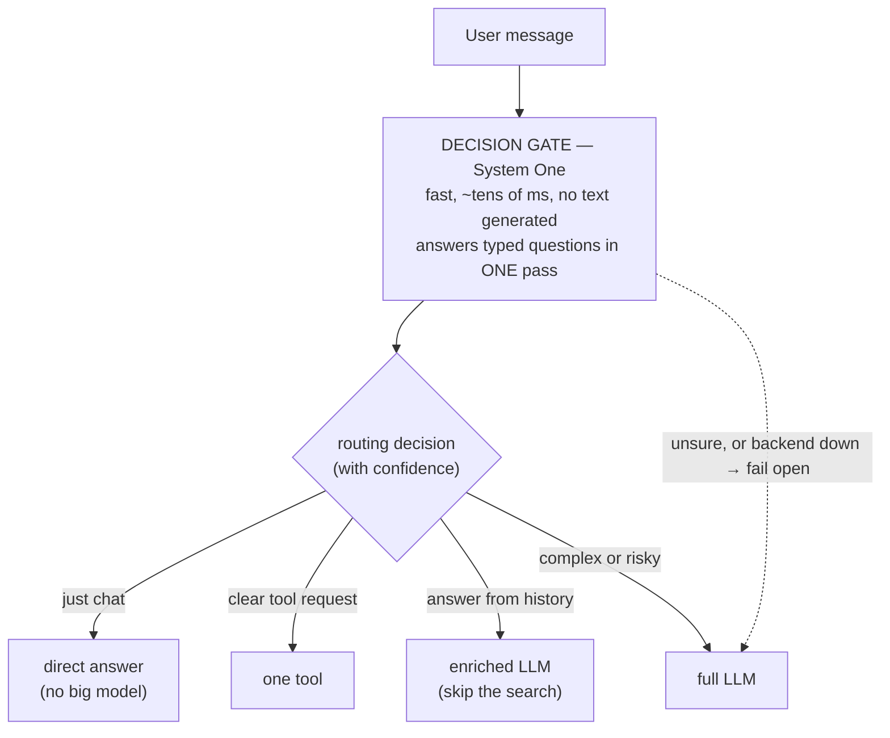

# The Superfast Harness

### A Decision Gate that makes AI agents react in milliseconds, not seconds

*A white paper on speeding up AI agent harnesses with a fast "System One" decision model.*

---

> **Read this first — license and author.**
> This work is by **Andrea Bruno**. It is released under **Creative Commons Attribution 4.0 (CC BY 4.0)**.
> You may copy it, share it, change it, build on it, and use it commercially. The only rule: **credit Andrea Bruno** as the author of the idea and this document, link the license, and say if you changed something. See the `LICENSE` file.
>
> **About a patent.** This architecture is new, and a new thing that can be used in a real product can often be patented around the world. The author made a clear choice: **not to patent it.** The idea is given to everyone, as a personal contribution to open technology. The one thing we ask in return is **attribution** — say who came up with it. Section 10 explains exactly what a patent would cover here, why that is different from the license above, and why we give it up on purpose.

---

## 1. The problem, in one line

In today's AI agents, **every user message wakes up a big, slow, expensive language model — even when the answer needs no big thinking at all.**

Think about what an agent does when you type something. It usually calls a large LLM to decide:
- What does the user want? (intent)
- Do I need a tool, or can I just answer?
- Which tool should I use first?
- Do I need the attachments, or the chat history?
- Is this action safe?

Each of these is a small, simple decision. But right now they are made by a **generative LLM** — the same heavy model that writes code and essays. That costs **1 to 3 seconds** and real money **per message**, even for "hello" or "what did we just change?".

On a normal cloud API this is just costly. On a **home computer or a small GPU (even 4 GB of VRAM)**, it is painfully slow. The agent feels sluggish.

## 2. The idea: put a fast "decider" in front of the big model

Human brains have two ways of thinking. Psychologists call them **System 1** and **System 2**:
- **System 1** is fast and automatic. You see a face and instantly know if it is a friend. No effort.
- **System 2** is slow and careful. You solve 17 × 24 in your head. Effortful.

A big LLM is a System 2. It is great at reasoning, but slow and costly for every little thing.

A new kind of small model — a **System One decision model** — is built only for the fast part. It does **not** write text. It looks at a situation and returns **typed answers with confidence scores**, in one quick pass.

**The invention is where we put it.** We place a System One model at the **front door** of the agent. We call this the **Decision Gate**.



The Gate reads the message and answers simple questions at once:
- *Is this just chat?* → answer right away, **no big model at all**.
- *Does it need a tool, and which one?* → run that tool.
- *Can I answer from the chat history or an attachment?* → use it, skip the search.
- *Is it complex or risky?* → hand it to the full LLM as usual.

Only the messages that truly need deep thinking reach the big model. Everything else is handled in milliseconds.

## 3. What the Decision Gate actually returns

A System One model answers three kinds of typed questions, all in parallel, in a single forward pass:

| Type | Question shape | Output |
|------|----------------|--------|
| **Choice** | "Pick one of these options" | a probability for each option + a confidence score |
| **Score**  | "Rate this from low to high" | a value across ordered levels + confidence |
| **Noul**   | "Yes or no?" | the probability that it is true |

Because the answers are **typed and calibrated**, the routing logic is simple and safe:
- High confidence → take the fast path.
- Low confidence → **fail open** to the full LLM. The agent is never worse than before; it is only faster when it is sure.

The Gate **cannot hallucinate a route**. It does not invent sentences. It only picks among options you defined, with a number attached.

## 4. Why this is fast and cheap

| | Old way (LLM decides) | With the Decision Gate |
|---|---|---|
| A simple chat message | 1–3 s (full LLM) | **tens of ms** (System One) |
| Picking a tool | 1–3 s | **tens of ms** |
| Cost per decision | full LLM price | a tiny fraction |
| Hallucination on routing | possible | **none** (no text) |

The big model is still there for the hard work. We just stop paying it for the easy work.

## 5. It runs on home hardware

This is the key for people who run models locally. The open-source System One models are **small** and run on **CPU only, or a small GPU with about 4 GB of VRAM** — the kind of machine many people already own.

Real, open-source options you can use today (Apache-2.0):

| Model | What it is | How you run it |
|-------|-----------|----------------|
| **Von** (`wfzyx`) | Open, non-autoregressive System One model. Has a **Python and a TypeScript SDK** (`von-sdk`). Serves a Jev-compatible `/v1/systemone` endpoint. | `von serve` (HTTP) or in-process via the SDK |
| **OpenJev** (`razorback16`) | Open, Jev-compatible System One decision server | HTTP server |
| **Laya** (`NandhaKishorM` / Convai Innovations) | Open, local decision model | local server |

The commercial reference is **Jev** by **TypeSafe AI** (the model that defined the "System One" idea). The open models above let you get the same effect **on your own machine, for free, with no cloud call.**

> The Decision Gate talks to any of these through one small interface. Swap the backend without changing the harness.

## 6. Design notes

These are the load-bearing choices. They are why the Gate is safe to adopt, not only fast.

- **Fail-open by construction.** If the Gate is unsure, times out, errors, or the backend is down, the message goes to the full LLM exactly as it does today. The worst case equals the current behavior. Adopting the Gate cannot make an agent worse — only faster when the Gate is sure.
- **Typed, calibrated output — no invented routes.** The Gate returns probabilities over options you defined (choice / score / noul). It generates no text, so it cannot hallucinate a sentence or a path. A fast route is taken only when its confidence clears a threshold; otherwise it fails open.
- **One forward pass, questions in parallel.** All questions are answered in a single encoder pass. Adding questions barely changes latency, so the Gate can ask intent, needs-a-tool, use-history, urgency, and more at the same time.
- **Backend-agnostic.** The Gate talks to any System One backend through one small interface (Von, OpenJev, Laya, or a hosted model). Swap the model without touching the harness.
- **Non-invasive and reversible.** Off by default. A single runtime toggle turns it on; off restores the exact prior behavior. The first real integration runs in **shadow mode** — it measures and logs the decision without changing routing — before it is ever allowed to act.
- **Confidence is the guardrail.** The design is "faster when sure, never worse when not." The threshold, not the model's confidence alone, decides whether the fast path is taken.

## 7. A concrete example: Qwen Code

> **This is only an example.** The architecture is **not tied to Qwen Code**. It can be added to any agent harness that has a "user message → decide → act" loop. If you use this design in your own harness, please credit Andrea Bruno (see the license).

Qwen Code is an open-source coding agent. Its loop is exactly the pattern this fixes: every message goes to a big LLM to decide intent, tools, and safety.

**How the Decision Gate would fit Qwen Code:**
- A new module sits between the input handler and the agent loop.
- On each message, it calls a local System One model (for example **Von** via `von-sdk`) with a small set of typed questions: intent, needs-a-tool, which-tool-first, use-history, use-attachments, urgency.
- High-confidence chat → answer or short-circuit without the big model.
- Clear tool request → start the tool.
- "Answer from history" → skip the re-investigation.
- Low confidence or risky → the normal full agent loop.

**The user sees it as optional.** In Qwen Code it would be turned on with a single command:

```
/superfast
```

Turn it off and nothing changes. Turn it on and the agent feels much more responsive, especially on a local model.

Qwen Code already has a two-stage safety classifier in its Auto Mode. That proves the harness is **already shaped for a fast decision model** — the Decision Gate is a natural, low-risk extension of a pattern that is already there.

> The full technical plan for the Qwen Code version is in [`qwen-code-implementation.md`](./qwen-code-implementation.md). That file is a working guide, not a fixed contract — it is expected to be improved while building.

## 8. What is claimed (the novel point)

Stated plainly, the contribution is:

1. Placing a **non-generative System One decision model at the entry point** of an AI agent harness, so that the routine decisions of the agent loop (intent, tool selection, context gating, safety triage) are made by a fast, calibrated model instead of a generative LLM.
2. A **priority-ordered routing layer** that reads the typed, probabilistic answers and sends each message to the cheapest correct path — direct answer, single tool, enriched call, or full LLM — and **fails open to the full LLM whenever confidence is low**, so the agent never loses capability.
3. Making this **optional and reversible at runtime** (a single toggle), and **runnable on consumer hardware** by backing the Gate with small open-source System One models.

The combination — *front-door decision gate + typed parallel questions + fail-open routing + consumer-hardware backend + runtime toggle* — is the point of this work.

## 9. The game changer for the collective

Most talk about AI agents is about making the big model bigger. This work goes the other way: it changes **where the machine spends its effort**, and that shift is worth a great deal to everyone.

- **Fast agents on hardware people already own.** The heavy decision work moves off the big generative model and onto a small encoder that runs on a CPU or a ~4 GB GPU. People without a datacenter get responsive agents on the machine already on their desk.
- **Less compute and less energy per interaction.** Skipping the big model on the messages that need no big thinking cuts time, GPU/VRAM occupancy, and network calls. At the scale of millions of messages, that is real money and real energy saved.
- **A pattern, not a product.** The front-door gate is a general method for any "user message → decide → act" loop — coding agents, chat assistants, automation. Once one harness proves it, others can adopt the same shape instead of rediscovering it from scratch.
- **A low-risk door into experimentation.** Because the Gate fails open, trying it cannot break an agent. That removes the fear that usually blocks this kind of change across a whole ecosystem.
- **Given freely, with attribution.** The method is released under CC BY 4.0. The collective can build on it, including commercially, without legal fear — the only ask is to say who came up with it.

The change is small in code and large in effect: stop paying the expensive model for the cheap decisions, and hand the savings — speed, cost, and access — to everyone.

## 10. On patents: what we give up, and what a patent would actually cover

This section makes the gift unambiguous. It explains what a patent would reach if one were pursued, why that is different from the license above, and why we choose not to pursue it.

**Copyright and a patent cover different things.**
The CC BY 4.0 license covers the *expression* — this document and the specific code we wrote. It does not stop someone from independently writing their own code that does the same thing. A **patent** is different: it protects the **functionality** — the way the software works and the technical result it produces — **independent of the programming language or the form of the code**. If a method is patented, a clean-room reimplementation in another language that performs the same method can still infringe. So giving up a patent is a larger gift than giving up code: it releases the *method itself*, not just our text.

**Could this be patented at all? The "further technical effect" test.**
In Europe and Italy, software "as such" is not patentable. A software-based invention — a **computer-implemented invention (CII)** — can be patented only if it produces a **"further technical effect"**: an effect that goes beyond the normal physical interaction between the software and the hardware (beyond simply making electric current flow when a program runs). The effect must solve a technical problem in a technical way and yield a technical result that is new and non-obvious.

The strongest case one could make for the Decision Gate is that its effect is **on the machine itself, and measurable**:
- it changes how the computer behaves — a single non-autoregressive encoder pass replaces a generative decode loop, so the routine decisions consume fewer cycles, less GPU/VRAM, and fewer network round-trips;
- it **enables a class of hardware** (CPU-only, or about 4 GB of VRAM) to run an interactive agent that would otherwise be too slow to use.

That is a technical effect on the machine's resource behavior, not a business method or a presentation of information. It is the kind of effect the CII test looks for.

**Being honest about the limits (so this stands up to scrutiny).**
We do **not** claim that a patent here is granted, or that it would certainly be granted. We state the limits plainly:
- The decision models (Jev, Von, OpenJev, Laya) are **third-party**. Any claim could cover only the **integration architecture and the routing method**, never the models themselves.
- The "further technical effect" test is **contested and applied inconsistently** across patent offices and jurisdictions. A latency-and-resource argument can be met with "that is only a user-experience improvement." We believe the resource-and-enablement framing answers that, but we do not pretend the outcome is certain.
- Non-obviousness at this boundary is genuinely debatable.

**The choice.**
Because patentability is uncertain and jurisdiction-dependent, and because the point of this work is to be built on, we **renounce the patent on the method**. We do not file, we do not reserve, and we do not assert any patent claim over the Decision Gate architecture. The method is given to the collective under **CC BY 4.0** — the only condition is attribution, which is a copyright condition, not a patent one. This renunciation is deliberate and unconditional: we would rather the idea spread and be improved by many than sit behind a claim we are not sure we could win and do not wish to enforce.

That is the whole position: a method that could arguably be claimed, given up on purpose, so that everyone can use it.

## 11. Honest notes

- The **decision models themselves are not ours.** Jev (TypeSafe AI) and the open analogs (Von, OpenJev, Laya) are third-party. What is presented here is the **architecture and method** that uses them to speed up an agent harness.
- The Gate is a **bias with a guardrail**, not a guarantee. When it is unsure, it must fall back to the full model. The design goal is "faster when sure, never worse when not."
- This document describes a **design and method**. It is not a claim that any specific product already ships it.

## 12. How to use this work

You are free to build on this. Please:
- **Credit Andrea Bruno** as the author of the Superfast Harness / Decision Gate concept and this white paper.
- Keep the **CC BY 4.0** notice and link.
- Say if you changed anything.

## 13. License

**CC BY 4.0** — Attribution 4.0 International.
Copyright (c) 2026 **Andrea Bruno**.
Full text: [`LICENSE`](./LICENSE) · License deed: <https://creativecommons.org/licenses/by/4.0/>
