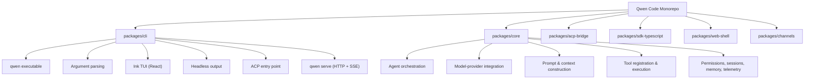
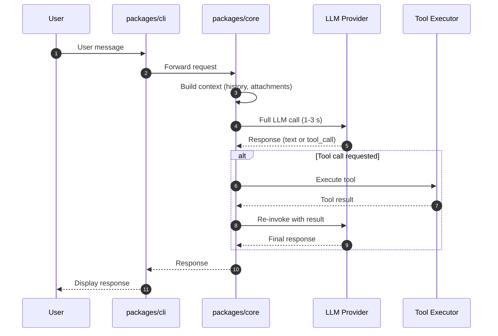
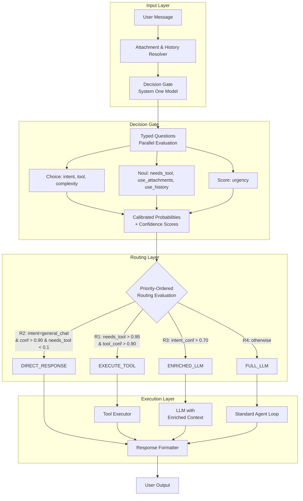
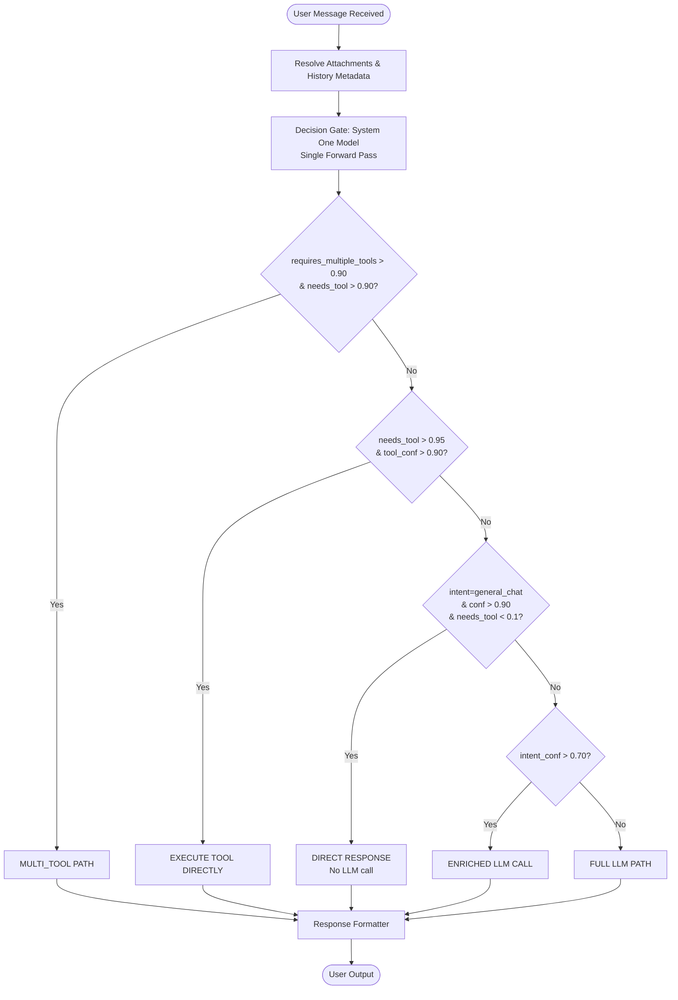
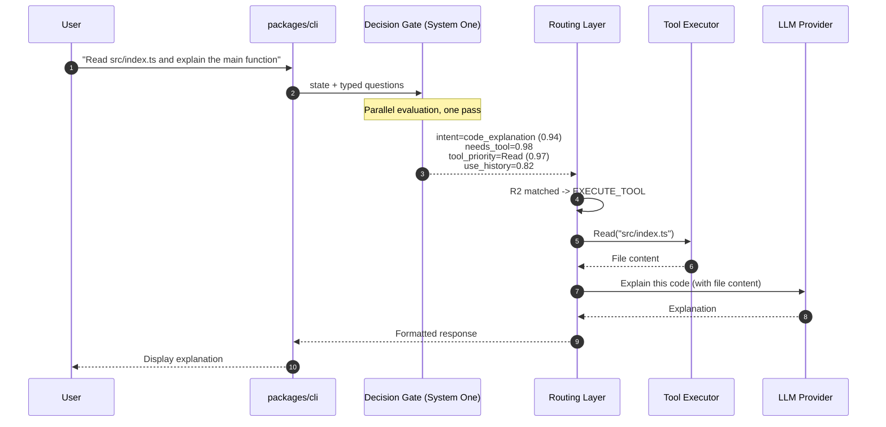
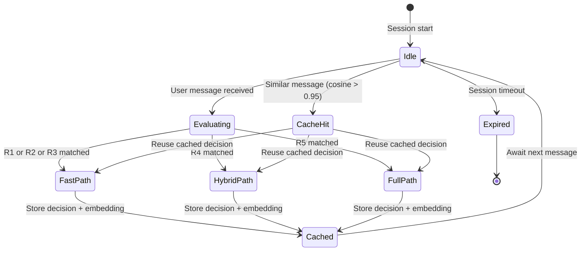
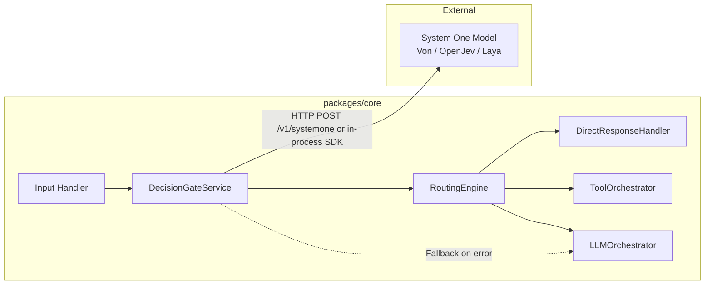
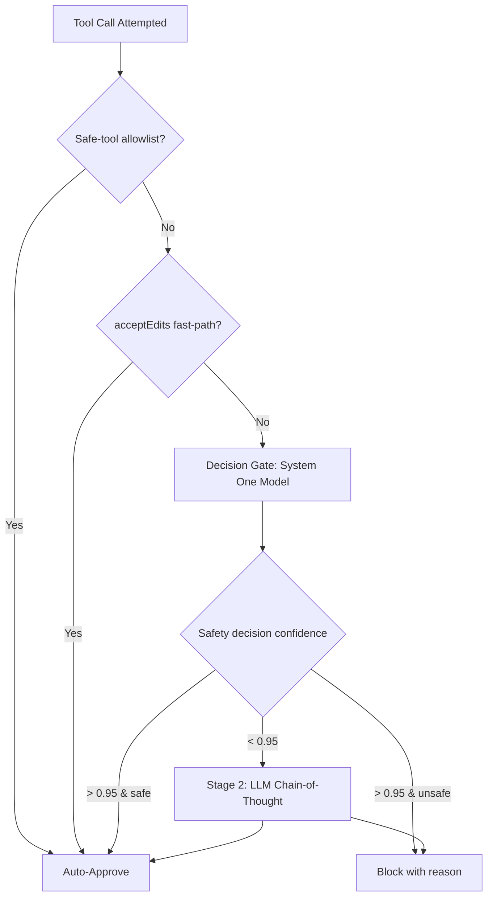

# Project: Integrating a System One Decision Gate into the Qwen Code Harness

> **Status: working guide, not a fixed contract.** This document is meant to be improved and adjusted as we learn while building on the real source. Treat every number and interface here as a starting point to be validated against the running system.
>
> **Authorship & license.** The Decision Gate concept and this guide are by **Andrea Bruno**, released under **CC BY 4.0** (see `LICENSE`). The decision models described below (Jev, Von, OpenJev, Laya) are **third-party** — this document describes the architecture that uses them, not the models themselves.

## 0. Corrections applied to the earlier draft

The first draft of this file mixed real and unverified references. Before building on it, the following were checked against primary sources and corrected:

| Earlier draft | Corrected to | Why |
|---|---|---|
| "jabr v2 could not be found" | **jabr v2 IS a real benchmark** (`github.com/jabr/classifier-benchmark`, 49 tasks / 869 cases) | Confirmed from the Von README; the earlier note was wrong. Jev 1.13 scores 96.6% v2-macro; Von 1.1 scores 72.0% |
| **JevK5** (allebee) | **OpenJev** (`razorback16`) | JevK5/allebee could not be found; OpenJev is a real, Jev-compatible open server |
| Gate latency "13–33 ms" | **Von ~18 ms local (sub-18 ms in-process); Jev ~115 ms API** | Aligned to the published numbers |
| `von-sdk` "TypeScript only" | **Python AND TypeScript** (`pip install von-sdk` / `npm install von-sdk` / `bun add von-sdk`) | Confirmed from the Von README |
| **Laya** author | **`NandhaKishorM` / Convai Innovations**, Apache-2.0 | Confirmed the real repo/author |

Two benchmarks are real and distinct: **jabr v2** (multi-domain decision accuracy) and **JevBench** (option-order diagnostic). Both are cited by the Von README.

The core idea and the Qwen Code analysis below are unchanged and sound.

---

## 1. Executive Summary

This project proposes integrating a **System One decision model** — Jev or an open-source equivalent such as **Von**, **OpenJev**, or **Laya** — into the **Qwen Code harness** to cut latency and cost in the agent loop. The core proposal is a **Decision Gate** placed before the main LLM that intercepts every user message, evaluates it against a set of typed questions in a single forward pass, and routes the request to the optimal path: direct response, single tool, enriched LLM call, or full LLM reasoning.

Expected outcomes: a large latency and cost reduction on decision-heavy workloads (Jev's own published figures are **40–200× faster** and up to **~440× cheaper** on System One-shaped queries), with **no hallucination risk on routing** (the Gate generates no text). The user can turn the whole thing on or off at runtime with a single **`/superfast`** command.

---

## 2. Qwen Code Harness Analysis

### 2.1 Repository Architecture

Qwen Code is an open-source TypeScript monorepo supporting an interactive terminal, headless and programmatic execution, the Agent Client Protocol (ACP), a long-running HTTP daemon, web and IDE clients, and messaging-channel adapters. The two primary packages are `packages/cli` and `packages/core`, supported by a suite of specialized packages.



`packages/cli` owns the executable and chooses the runtime mode from command-line arguments. `packages/core` provides UI-independent agent orchestration, model-provider integration, prompt and context construction, tool registration and execution, permissions, sessions, memory, and telemetry.

### 2.2 Agent Execution Models

Qwen Code has **two agent execution models**:

- **Direct execution**: the interactive TUI and headless CLI construct and run the agent runtime directly.
- **ACP execution**: `qwen --acp` hosts the agent behind an ACP transport, drivable by an ACP client directly or by `qwen serve` through the shared ACP bridge.

The core loop logic resides in `packages/core/src/core/client.ts`, with non-interactive mode wrapping it via `packages/cli/src/nonInteractiveCli.ts`.



### 2.3 Decision Points and Current Latency

| # | Decision Point | Type | Current Implementation | Latency |
|---|---|---|---|---|
| 1 | Intent classification | Choice | Main LLM | 1-3 s |
| 2 | Tool selection | Choice | Main LLM | 1-3 s |
| 3 | Attachment context gating | Noul | Main LLM | 1-3 s |
| 4 | History context gating | Noul | Main LLM | 1-3 s |
| 5 | Urgency assessment | Score | Main LLM | 1-3 s |
| 6 | Tool approval (Auto Mode) | Noul | Two-stage LLM classifier | ~300 ms (Stage 1) |
| 7 | Sub-agent routing | Choice | Main LLM | 1-3 s |
| 8 | Side-query model selection | Choice | Configured fast model | Variable |

**Auto Mode** already uses a three-layer filter: (1) an `acceptEdits` fast-path for in-workspace edits, (2) a safe-tool allowlist for read-only built-in tools, and (3) an **LLM classifier** for shell commands, web fetches, sub-agent spawns, edits outside the workspace, and MCP tools. The classifier has two stages: **Stage 1 (fast)** outputs `{ shouldBlock }` in roughly 300 ms using the configured fast model; **Stage 2 (thinking)** runs only when Stage 1 says block, using chain-of-thought review to reduce false positives.

**Key insight:** this existing two-stage classifier proves the harness is **already predisposed to specialized decision models**. The Decision Gate is a natural extension of a pattern that already exists, which lowers integration risk.

---

## 3. System One Decision Models: Specifications

System One models are a class of AI models built to make **fast, structured decisions** that software can use directly. They evaluate a **state** and return **typed answers with calibrated probabilities**, without generating text. Three question types are supported:

- **Choice**: pick from a set of options. Returns a probability per option and an overall confidence score.
- **Score**: rate an input against ordered levels. Returns a continuous score, the underlying distribution, and a confidence value.
- **Noul**: answer a yes/no question. Returns the probability that a statement is true.

Multiple questions about the same state are evaluated **in parallel**; adding questions barely changes response time.

### 3.1 Model Comparison (verified)

| Model | Author | License | Runs on | SDK / interface | Notes |
|---|---|---|---|---|---|
| **Jev** | TypeSafe AI | Proprietary (early access) | Hosted API | TypeSafe API (`state` + `questions`) | The reference System One model. Choice up to 255 options. 70-500 ms. Published "40-200x faster", "193.6x faster / 444.6x cheaper" on workflow evals. |
| **Von** | `wfzyx` | **Apache-2.0** | CUDA, ROCm, Metal, OpenVINO (Intel iGPU), multithreaded CPU | **Python `von-sdk` AND TypeScript `von-sdk` (npm/bun)**; `von serve` exposes a Jev-compatible `/v1/systemone` endpoint | Non-autoregressive, 395M params (~1.5 GB, ModernBERT-Large). Single encoder pass regardless of option count. ~18 ms local. JevBench (v1.2): easy 100% / standard 63.9% / hard 38.7%, 0% answer-flips under option reordering. jabr v2 (v1.1): 72.0% macro. |
| **OpenJev** | `razorback16` | Open source | Self-hosted | Jev-compatible decision server | Open, Jev-compatible System One server. |
| **Laya** | `NandhaKishorM` / Convai Innovations | **Apache-2.0** | Local | Local decision server (`stiermid/laya-serve` is a Jev-compatible Laya server) | Open, local decision model. |

**For a home machine (CPU-only or ~4 GB VRAM), Von is the primary choice**: it is Apache-2.0, runs on CPU, ships a **TypeScript SDK** that drops straight into the Qwen Code codebase, and serves the Jev-compatible `/v1/systemone` endpoint if you prefer a sidecar process.

> **Note on the earlier draft:** "JevK5 (allebee)" could not be verified and is replaced by OpenJev. The "jabr v2" benchmark is **real** (it was wrongly flagged in an earlier pass) and is distinct from JevBench.

---

## 4. Proposed Architecture: The Decision Gate

### 4.1 High-Level Architecture



### 4.2 Decision Gate Question Schema

```typescript
interface DecisionGateRequest {
  state: string; // User message + session metadata
  questions: {
    intent: {
      type: 'choice';
      instructions: 'Classify the primary intent of the user message';
      options: [
        'code_generation', 'code_explanation', 'file_operation',
        'web_search', 'math_calculation', 'api_call',
        'data_analysis', 'creative_writing', 'general_chat'
      ];
    };
    needs_tool: {
      type: 'noul';
      instructions: 'Does the user request require an action that needs a tool?';
    };
    tool_priority: {
      type: 'choice';
      instructions: 'Which tool should be used first?';
      options: ['Read', 'Write', 'Edit', 'Bash', 'Grep', 'Glob', 'WebFetch', 'None'];
    };
    use_attachments: {
      type: 'noul';
      instructions: 'Does the message reference attachments or files mentioned in the conversation?';
    };
    use_history: {
      type: 'noul';
      instructions: 'Can the response be given from the previous conversation, without new investigation?';
    };
    urgency: {
      type: 'score';
      instructions: 'Rate the urgency of the request';
      levels: ['very_low', 'low', 'medium', 'high', 'very_high'];
    };
    complexity: {
      type: 'choice';
      instructions: 'Estimate the complexity of the request';
      options: ['simple', 'moderate', 'complex', 'very_complex'];
    };
    requires_multiple_tools: {
      type: 'noul';
      instructions: 'Does the request require more than one distinct tool action?';
    };
  };
}
```

**Option-count note:** the `tool_priority` question has 8 options. Jev supports up to 255; keep any single question within the chosen backend's limit. Von and Laya have no practical small-option limit; if you pick a backend with a low cap, split large option sets into a two-stage score-then-choose.

### 4.3 Routing Logic

```typescript
interface DecisionResult {
  intent: { choice: string; confidence: number };
  needsTool: { noul: number; confidence: number };
  toolPriority: { choice: string; confidence: number };
  useAttachments: { noul: number; confidence: number };
  useHistory: { noul: number; confidence: number };
  urgency: { score: number; confidence: number };
  complexity: { choice: string; confidence: number };
  requiresMultipleTools: { noul: number; confidence: number };
}

type Route =
  | { action: 'EXECUTE_TOOL'; tool: string; context: ContextFlags }
  | { action: 'DIRECT_RESPONSE'; reason: string }
  | { action: 'ENRICHED_LLM'; context: ContextFlags; reason: string }
  | { action: 'FULL_LLM'; reason: string }
  | { action: 'MULTI_TOOL'; tools: string[]; reason: string }
  | { action: 'FALLBACK'; reason: string };

function routeRequest(decision: DecisionResult): Route {
  const HIGH = 0.90;
  const MEDIUM = 0.70;

  // R1: Clear multi-tool request -> MULTI_TOOL
  if (
    decision.requiresMultipleTools.noul > HIGH &&
    decision.needsTool.noul > HIGH
  ) {
    return {
      action: 'MULTI_TOOL',
      tools: ['Read', 'Grep', 'Edit'], // resolved by the tool orchestrator
      reason: 'multi_tool_request',
    };
  }

  // R2: Clear single-tool request -> EXECUTE_TOOL
  if (
    decision.needsTool.noul > 0.95 &&
    decision.toolPriority.confidence > HIGH &&
    decision.toolPriority.choice !== 'None'
  ) {
    return {
      action: 'EXECUTE_TOOL',
      tool: decision.toolPriority.choice,
      context: {
        includeAttachments: decision.useAttachments.noul > 0.5,
        includeHistory: decision.useHistory.noul > 0.5,
      },
    };
  }

  // R3: Obvious chat -> DIRECT_RESPONSE (no big model)
  if (
    decision.intent.confidence > HIGH &&
    decision.intent.choice === 'general_chat' &&
    decision.needsTool.noul < 0.1
  ) {
    return { action: 'DIRECT_RESPONSE', reason: 'obvious_chat' };
  }

  // R4: Medium confidence -> ENRICHED_LLM
  if (decision.intent.confidence > MEDIUM) {
    return {
      action: 'ENRICHED_LLM',
      context: {
        includeAttachments: decision.useAttachments.noul > 0.5,
        includeHistory: decision.useHistory.noul > 0.5,
        precomputedIntent: decision.intent.choice,
      },
      reason: 'medium_confidence_enrichment',
    };
  }

  // R5: Low confidence -> FULL_LLM (fail open)
  return { action: 'FULL_LLM', reason: 'low_confidence' };
}
```

### 4.4 Decision Flow



### 4.5 Sequence Diagram: Tool Execution Path



### 4.6 Session-Level Decision Caching



### 4.7 Fail-Open Fallback When the Gate Is Unavailable

If the System One model is unreachable (network error, model crash, timeout), the system **fails open** to the full LLM path. The agent is never worse than today.

```typescript
async function decideWithFallback(
  state: string,
  questions: DecisionGateRequest,
  timeoutMs = 150,
): Promise<DecisionResult | null> {
  try {
    const controller = new AbortController();
    const timeout = setTimeout(() => controller.abort(), timeoutMs);
    const response = await fetch('http://localhost:8000/v1/systemone', {
      method: 'POST',
      body: JSON.stringify({ state, questions }),
      signal: controller.signal,
    });
    clearTimeout(timeout);
    return await response.json();
  } catch {
    return null; // Caller uses FULL_LLM
  }
}
```

---

## 5. Integration Strategy

### 5.1 Integration Point in `packages/core`

The Decision Gate is a new module, `DecisionGateService`, sitting between the CLI input handler and the agent orchestration layer.



Two backend modes:
- **In-process** via the **TypeScript `von-sdk`** (`npm install von-sdk`) — lowest latency, no extra process.
- **Sidecar HTTP** via `von serve` (or OpenJev / Laya) exposing `/v1/systemone` — easier to swap or scale.

### 5.2 Auto Mode Enhancement

The existing two-stage Auto Mode classifier can be replaced or front-loaded by the Decision Gate for the fast path:



### 5.3 The `/superfast` Command (user-facing toggle)

The whole feature is **optional and reversible at runtime**. In Qwen Code it is controlled by a slash command:

```
/superfast on     # enable the Decision Gate for this session
/superfast off    # disable it; behave exactly as before
/superfast status # show backend, thresholds, hit/miss stats
```

- **Default: off.** Nothing changes until the user opts in.
- When **on**, the `DecisionGateService` is wired into the loop and a local System One backend must be reachable; if it is not, the Gate fails open (Section 4.7).
- The setting can also be persisted in `settings.json` (e.g. `superfast.enabled`, `superfast.backend`, `superfast.thresholds`) for users who want it always on.

This keeps the change safe and reversible: a user who does not run `/superfast` sees the current behavior unchanged.

### 5.4 Deployment Topology

```mermaid
graph TD
    subgraph Qwen Code Process
        CLI[packages/cli]
        Core[packages/core]
        DG[DecisionGateService]
    end

    subgraph Sidecar Process
        SO[System One Model<br/>Von / OpenJev / Laya]
        SO_API[HTTP Server<br/>POST /v1/systemone]
        SO --> SO_API
    end

    CLI --> Core
    Core --> DG
    DG -->|HTTP| SO_API

    subgraph Embedded Alternative
        VONSDK[von-sdk (TypeScript)]
        DG2[DecisionGateService] --> VONSDK
    end
```

For **lowest latency**, embed Von via its TypeScript SDK (`von-sdk`) in-process. For **swap-ability or scaling**, run `von serve` (or OpenJev / Laya) as a sidecar.

---

## 6. Expected Impact

| Metric | Current (LLM-only) | With Decision Gate | Improvement |
|---|---|---|---|
| Latency — obvious chat | 1-3 s | tens of ms | large |
| Latency — tool routing | 1-3 s | ~ tens of ms | large |
| Latency — Auto Mode approval | ~300 ms | ~ tens of ms | large |
| Cost — per decision | full LLM price | a small fraction | large |
| Hallucination risk on routing | non-zero | **zero** (no text generated) | eliminated |

> Jev's own published figures for System One-shaped queries are **40-200× faster** and up to **~444× cheaper**. The exact gain for Qwen Code depends on the backend and the mix of messages; measure it in shadow mode before trusting a number.

---

## 7. Implementation Roadmap

### Phase 1: Prototype

| Task | Deliverable | Success Criteria |
|---|---|---|
| Deploy Von via `von-sdk` (in-process) | TypeScript module with `decideWithFallback()` | Unit tests pass; integrates with the input handler |
| A/B test on 500+ real requests | Comparison dataset with routing accuracy | Gate agrees with the LLM > 92% on high-confidence paths |
| Instrument latency & fallback rate | Metrics | Fallback rate < 15% on the test set |

### Phase 2: Optimization

| Task | Deliverable | Success Criteria |
|---|---|---|
| Fine-tune the backend on the Qwen Code domain | Custom checkpoint | Routing accuracy improves by > 5% |
| Calibrate confidence thresholds | Threshold config | False positive rate < 2% on tool routing |
| Integrate with Auto Mode | Replace/augment the two-stage classifier | Approval latency < 50 ms |
| Implement decision caching | Session-level cache with embedding similarity | Cache hit rate > 40% on repeated patterns |

### Phase 3: Production

| Task | Deliverable | Success Criteria |
|---|---|---|
| Ship `/superfast` behind a feature flag | Command + settings | Off by default; on is stable |
| Shadow-mode validation | Parallel Gate + LLM | Zero user-facing regressions |
| Gradual rollout | Percentage ramp | Full ramp after a stable shadow period |
| Monitoring | Dashboard: latency, accuracy, savings | Real-time visibility |

---

## 8. Risk Analysis and Mitigation

| Risk | Likelihood | Impact | Mitigation |
|---|---|---|---|
| Incorrect routing decisions | Medium | High | High confidence threshold (0.90+); automatic fail-open to full LLM on low confidence |
| Added latency from the Gate | Low | Low | Single encoder pass; in-process SDK; fail-open on timeout |
| Model drift over time | Medium | Medium | Continuous monitoring; periodic re-finetuning; shadow-mode validation |
| Backend unavailability | Low | Medium | Fail-open with timeout; fallback to FULL_LLM |
| Option-count limits on a chosen backend | Low | Low | Split large option sets into score-then-choose; pick a backend with a high cap |
| Stale-context answers (answering from history when it changed) | Medium | High | The `use_history` gate must be conservative; prefer re-check when state may have changed (see the companion "answer from context first" guardrail) |

---

## 8.5 Implementation status (first PR)

A first increment has been implemented in the Qwen Code fork and submitted upstream (feature request + PR). It ships the gate **running in shadow mode**: when enabled it classifies each turn and logs the recommendation, but does not yet change routing. Acting on the route is the validated follow-up.

**What is in the code:**

- `packages/core/src/superfast/decision-gate.ts` — the `DecisionGateService`: `querySystemOne()`, `classifyTurn()`, `probeBackend()`, `resolveGateSettings()`. Typed choice/noul/score; **fails open** on any error, timeout, non-2xx, or malformed body.
- `packages/core/src/config/config.ts` — `superfast` parameter + `getSuperfastSettings()`.
- `packages/core/src/core/client.ts` — a **shadow pass** at the top of `sendMessageStream` for user turns. Fire-and-forget: not awaited, every failure swallowed, so it can never add latency to or break the real turn.
- `packages/cli/src/commands/von-install.ts` — the `von-install` subcommand that provisions the Von backend.
- `packages/cli/src/ui/commands/superfast-command.ts` — `/superfast on|off|status`.
- `packages/cli/src/config/settingsSchema.ts` — the `superfast` settings section.

**Real `/v1/systemone` wire schema** (Jev-compatible, as served by `von serve`):

Request:

```json
{
  "model": "von-1.2.0",
  "state": "the user turn text (or a structured object)",
  "questions": {
    "needs_tool": { "type": "noul", "instructions": "Does this need a tool action?" },
    "intent": { "type": "choice", "instructions": "Classify the intent", "criteria": { "chat": "...", "code_change": "..." } },
    "urgency": { "type": "score", "instructions": "Rate urgency", "criteria": ["low", "medium", "high"] }
  }
}
```

Response:

```json
{
  "answers": {
    "needs_tool": { "noul": 0.92 },
    "intent": { "choice": "code_change", "confidence": 0.88, "probabilities": { "chat": 0.05, "code_change": 0.88 } },
    "urgency": { "score": 1.7, "confidence": 0.74 }
  }
}
```

**Architectural coherence (why this fits Qwen Code rather than looking foreign):**

1. **Install-the-backend-via-a-command** — `von-install` mirrors the existing `qwen sandbox` install/inspect convention. The fork never bundles the model.
2. **A specialized decision model already exists** — the AUTO approval-mode two-stage classifier (`packages/core/src/permissions/classifier.ts`) is the same schema-typed, fail-safe pattern; the gate is that pattern at the front door.
3. **Off by default, flag + slash command** — `/superfast` and a `superfast` settings section, matching how experimental builtins are gated.
4. **Fails open** — the gate can only make the harness faster, never change behavior when unsure.
5. **No new runtime dependencies** — plain `fetch` to a local endpoint.

---

## 9. Conclusion

Integrating a **System One decision model** into the Qwen Code harness shifts routine decisions — intent classification, tool selection, context gating, and safety approval — from expensive System 2 LLM calls to fast, calibrated System 1 inference. The **Decision Gate** is modular, non-invasive, and fail-safe: it sits at the entry point of the agent loop, evaluates typed questions in a single forward pass, and routes requests through a priority-ordered evaluation that fails open to the full LLM on low confidence.

With **Von** (Apache-2.0, TypeScript SDK, Jev-compatible `/v1/systemone`), **OpenJev**, or **Laya** as the backend, it runs on consumer hardware. The existing **Auto Mode two-stage classifier** is a proven insertion point. The user controls it with a single **`/superfast`** toggle, so the change is optional and reversible.

> This is a working guide. Adjust the numbers, thresholds, and interfaces against the real system as you build. The concept and this document are by **Andrea Bruno** (CC BY 4.0); the decision models are third-party.
